# Sistema de Control de Asistencia Operacional (SCAO)

El **SCAO** es una plataforma integral diseñada para gestionar, visualizar y controlar la asistencia y disponibilidad de trabajadores bajo sistemas de turnos 10x10 en faenas logísticas. Su objetivo principal es proveer una "fuente única de verdad" sobre la dotación diaria, eliminando incertidumbres operativas y riesgos contractuales.

## 🚀 Características Principales

-   **Gestión de Turnos 10x10**: Control automático de ciclos y rotaciones (Turnos A/B).
-   **Dashboard Operativo**: Visualización en tiempo real de la dotación disponible vs. planificada.
-   **Trazabilidad Completa**: Registro de auditoría para cada cambio de estado, asistencia o permiso.
-   **Gestión de Estados**: Manejo riguroso de estados excluyentes (Licencias, Vacaciones, Ausencias, Asistencia).
-   **Multi-Rol**: Perfiles específicos para Operaciones, Supervisores, RRHH y Gerencia.

## 🛠 Stack Tecnológico

-   **Frontend & API**: [Next.js](https://nextjs.org/) (React) - Framework Fullstack.
-   **Base de Datos**: [SQLite](https://www.sqlite.org/index.html) (con [Prisma ORM](https://www.prisma.io/)).
    -   *Nota*: Se elige SQLite por su portabilidad y facilidad de despliegue local (sin dependencias de servicios externos). El modelo está diseñado para ser migrado fácilmente a PostgreSQL si la escala lo requiere.
-   **Estilos**: CSS Moderno (Variables, Flexbox/Grid) para una interfaz premium y responsiva.

## 🗂 Modelo de Datos (ERD)

El núcleo del sistema se basa en un modelo relacional estricto para garantizar la integridad de los datos.

```mermaid
erDiagram
  WORKER {
    uuid worker_id PK
    string rut UK
    string full_name
    boolean active
    datetime created_at
    uuid created_by_user_id FK
    datetime updated_at
    uuid updated_by_user_id FK
  }

  USER_ACCOUNT {
    uuid user_id PK
    string email UK
    string full_name
    string role "ADMIN|RRHH|SUPERVISOR|OPERACIONES|GERENCIA"
    boolean active
    datetime created_at
  }

  WORKER_EMPLOYMENT {
    uuid employment_id PK
    uuid worker_id FK
    string contract_type
    date hire_date
    date termination_date
    string status "VIGENTE|TERMINADO|SUSPENDIDO"
    datetime created_at
    uuid created_by_user_id FK
  }

  WORKER_UNION_MEMBERSHIP {
    uuid union_membership_id PK
    uuid worker_id FK
    string union_name
    date start_date
    date end_date
    datetime created_at
    uuid created_by_user_id FK
  }

  SHIFT_GROUP {
    uuid shift_group_id PK
    string code UK "A|B"
    string name
    int cycle_days "default 10"
  }

  SHIFT_CYCLE_CALENDAR {
    uuid cal_id PK
    date date UK
    uuid active_shift_group_id FK
    int cycle_number
    int cycle_day "1..10"
    datetime created_at
    uuid created_by_user_id FK
  }

  WORKER_SHIFT_ASSIGNMENT {
    uuid assignment_id PK
    uuid worker_id FK
    uuid shift_group_id FK
    date start_date
    date end_date
    string reason
    datetime created_at
    uuid created_by_user_id FK
  }

  LEAVE_TYPE {
    uuid leave_type_id PK
    string code UK "LM|VAC"
    string name
    boolean blocks_attendance
  }

  LEAVE_REQUEST {
    uuid leave_id PK
    uuid worker_id FK
    uuid leave_type_id FK
    date start_date
    date end_date
    string status "REGISTRADA|APROBADA|RECHAZADA|ANULADA"
    string document_ref
    datetime created_at
    uuid created_by_user_id FK
  }

  PERMISSION_REQUEST {
    uuid permission_id PK
    uuid worker_id FK
    date date
    string reason
    string status "REGISTRADO|APROBADO|RECHAZADO|ANULADO"
    datetime created_at
    uuid created_by_user_id FK
  }

  ATTENDANCE_MARK {
    uuid mark_id PK
    uuid worker_id FK
    datetime timestamp
    string mark_type "IN|OUT|CHECK"
    string source "MANUAL|APP|QR|BIOMETRIA|API"
    uuid captured_by_user_id FK
    string note
  }

  ATTENDANCE_DAILY {
    uuid attendance_daily_id PK
    uuid worker_id FK
    date date
    uuid shift_group_id FK
    string status "PRESENTE|AUSENTE|PERMISO|LICENCIA|VACACIONES"
    string status_reason
    string source "CALCULADO|MANUAL"
    boolean locked
    datetime created_at
    uuid created_by_user_id FK
    datetime updated_at
    uuid updated_by_user_id FK
  }

  AUDIT_LOG {
    uuid audit_id PK
    string entity_name
    string entity_id
    string action "CREATE|UPDATE|DELETE"
    uuid changed_by_user_id FK
    datetime changed_at
    string diff_json
  }

  %% Relationships
  USER_ACCOUNT ||--o{ WORKER : "created/updated by"
  USER_ACCOUNT ||--o{ WORKER_EMPLOYMENT : "created by"
  USER_ACCOUNT ||--o{ WORKER_UNION_MEMBERSHIP : "created by"
  USER_ACCOUNT ||--o{ SHIFT_CYCLE_CALENDAR : "created by"
  USER_ACCOUNT ||--o{ WORKER_SHIFT_ASSIGNMENT : "created by"
  USER_ACCOUNT ||--o{ LEAVE_REQUEST : "created by"
  USER_ACCOUNT ||--o{ PERMISSION_REQUEST : "created by"
  USER_ACCOUNT ||--o{ ATTENDANCE_MARK : "captured by"
  USER_ACCOUNT ||--o{ ATTENDANCE_DAILY : "created/updated by"
  USER_ACCOUNT ||--o{ AUDIT_LOG : "changed by"

  WORKER ||--o{ WORKER_EMPLOYMENT : has
  WORKER ||--o{ WORKER_UNION_MEMBERSHIP : has
  WORKER ||--o{ WORKER_SHIFT_ASSIGNMENT : assigned
  WORKER ||--o{ LEAVE_REQUEST : requests
  WORKER ||--o{ PERMISSION_REQUEST : requests
  WORKER ||--o{ ATTENDANCE_MARK : generates
  WORKER ||--o{ ATTENDANCE_DAILY : has

  SHIFT_GROUP ||--o{ SHIFT_CYCLE_CALENDAR : "active on date"
  SHIFT_GROUP ||--o{ WORKER_SHIFT_ASSIGNMENT : assigned_to
  SHIFT_GROUP ||--o{ ATTENDANCE_DAILY : expected_shift

  LEAVE_TYPE ||--o{ LEAVE_REQUEST : typed_as
```



## 📦 Instalación y Ejecución

### Usando Docker (Recomendado)

1.  **Ejecutar**:
    ```bash
    docker compose up
    ```
2.  **Acceder**:
    El sistema estará disponible en `http://localhost:3000`.

### Desarrollo Local (Opcional)

1.  **Instalar dependencias**: `npm install`
2.  **Base de Datos**: `npx prisma migrate dev`
3.  **Iniciar**: `npm run dev`
